# Look_ecommerce
SQL BigQuery and Power BI project.

## Overview
In this project, I used BigQuery SQL to gain valuable business insights from data and visualise them with Power BI.

TheLook is a fictitious eCommerce clothing site developed by the Looker team. The dataset 'theLook eCommerce' contains information about customers, products, orders, logistics, web events and digital marketing campaigns. This dataset is available in BigQuery Public Data.

## Project stages
- Analysis of database schema,
- Writing SQL queries in Google BigQuery to extract data,
- Creating views to store necessary data,
- Importing views to Power BI in order to create visualisations.

## Dataset
In general, `theLook eCommerce` dataset contains seven tables, but in my project I made use of six of them.
Here's diagram depicting database tables and relationships between them:
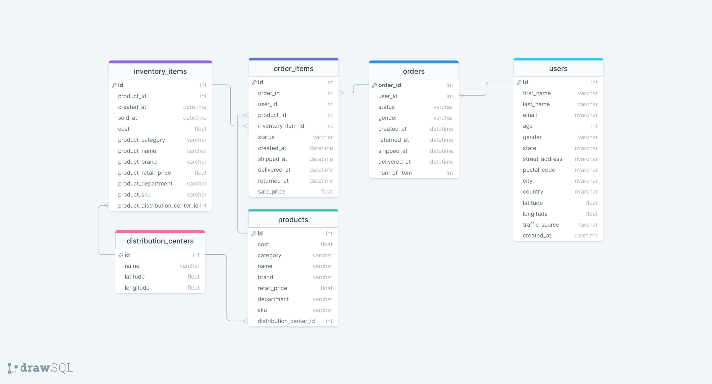

## Data analysis 
In the following sections I analysed different aspects of 'theLook eCommerce' activity: 
- Returns,
- Logistics,
- Sales,
- Customers,
- Traffic sources.

### Returns
**1. Firstly, I compared overall return rate for all years (2019-2023) with return rate in particular years:**
   
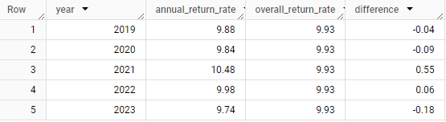

**Insights:**
- Only in 2021 and 2022 return rate exceeded overall rate,
- Nonetheless, differences between annual and overall rates aren't significant: from -0.18 to 0.55 percentage points.

**2. Then, I tried to find most returned product in each category:**

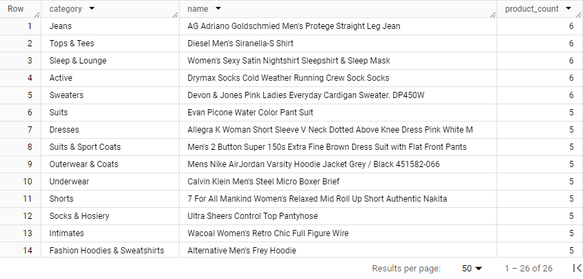

This information may be used to further investigate reasons for returning these products or maybe even withdraw them from the offer.

### Logistics
Logistics Department wants to know more about time between placing an order and shipping from distribution centers.

**1. How does the number of ordered items affect time necessary to ship the order?**

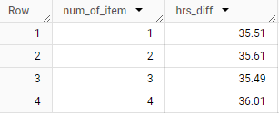

**Insights:**
- There is no positive correlation between number of items per order and time to ship an order: orders containing 3 items are shipped faster than orders with 1 or 2 items.

**2. Compare performance of each distribution center with overall time needed to ship an order:**

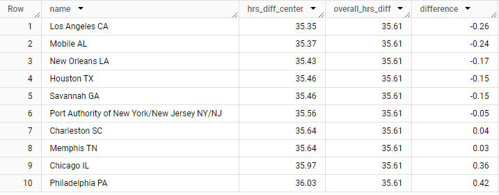

**Insights:**
- Los Angeles, Mobile, New Orleans, Houston, Savannah and Port Authority of New York/New Jersey performed better than average time,
- Charleston's, Memphis', Chicago's and Philadelphia's performance was worse than overall,
- Differences vary from -0.26 to 0.42.

### Sales
**1. Comparing sales in December for all years:**

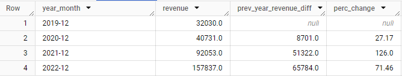

And here's the bar chart depicting sales in December:

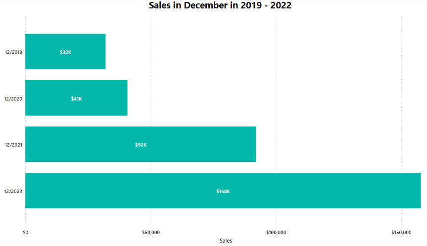

**Insights:**
- Sales growths from year to year: from 32 000 $ in 2019 to 158 000 $ in 2022,
- The biggest percentage growth occurred between 2020 and 2021: 126%.

 **2. Get YTD sales for each brand:**

 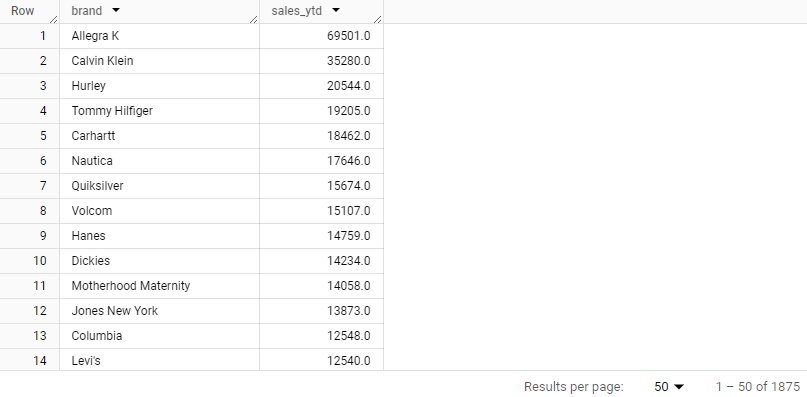

 And here's the treemap chart showing top 5 selling brands:

  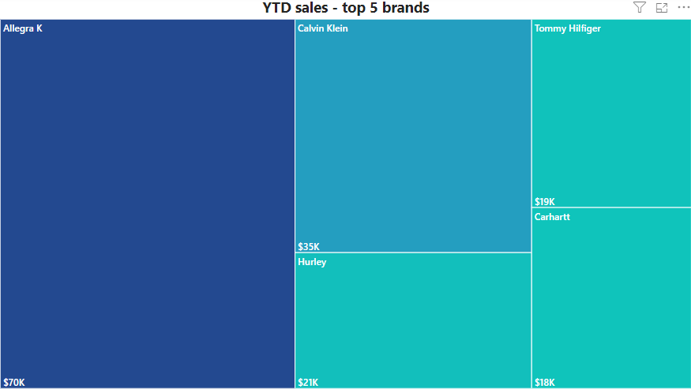
    
 **Insights:**
 - Top 5 selling brands are: Allegra K, Calvin Klein, Hurley, Tommy Hilfiger, Carhartt. 

### Customers
Marketing Department wants to:

**1. Target customers who were unactive for more than 100 days. Grab their contact details:**

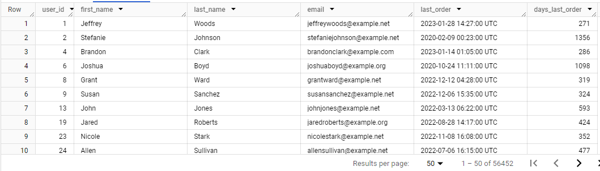

**2. Launch new campaign targeting female customers from China aged 20 - 40. Get their personal details:**

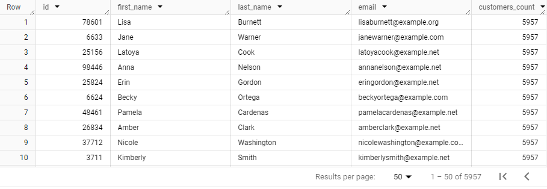

**3. Grant special discounts to 10 customers with the biggest spending. Please provide their details:**

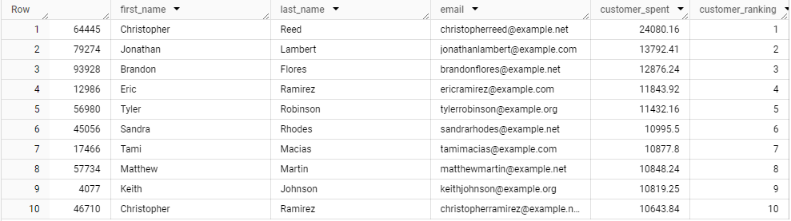

### Traffic source
**Company wants to assess which sources generated the most traffic in each year:**

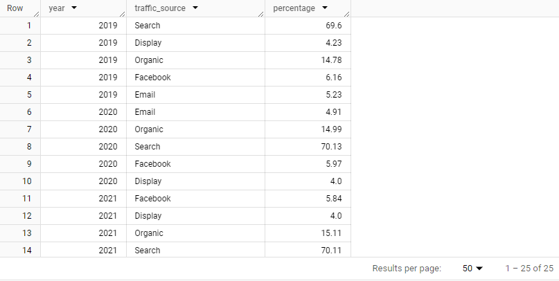

Breakdown is also shown on this stacked column chart:

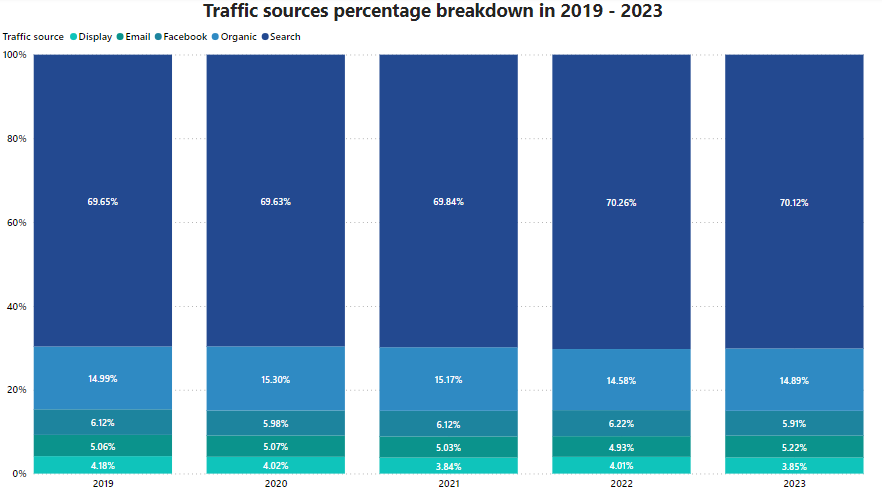

 **Insights:**
 - Breakdown of traffic sources remains steady throughout years,
 - About 70% of traffic is generated by search,
 - Organic source generates about 15%,
 - Facebook contributes to about 6%,
 - Least effective source are: email (about 5%) and display (about 4%).
